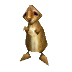
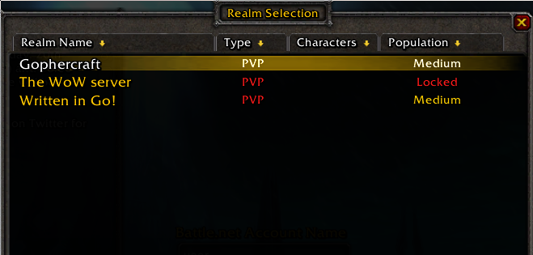

# Gophercraft (Very WIP)

Gophercraft is a Go library for experimentation with various World of Warcraft-related protocols and formats.

Gophercraft is currently in development: expect a lack of features and expect the API to change frequently.

Remember, contributions are always welcome. If you've added additional functionality, why not submit a pull request?

## Goals

- Authserver ✓
- Authentication protocol client ✓
- HTTP JSON API for facilitating registration and serving up world data ✓
- Rich web application utilizing the Gophercraft JSON API, browsing players, stats, items and guilds
- Easy-to-use admin interface
- Scriptable worldserver 
- Support for Windows and Mac OS X
- Game protocol client
- Conversion/extraction tools written in pure Go

In general, this project aims to create a secure, readable and extensible codebase for MMORPG software.

## Why start from scratch in Go?

Go uses a simpler syntax than C++, making code reading easier.

Unlike C++, Go provides memory safety at the language level, making memory-based RCE exploits impossible.

Go also provides many libraries that the protocol requires, like `net`, `crypto/sha1`, `crypto/hmac` and `compress/zlib` as part of the Go Standard Library, eliminating the need for arduous dependency management.

## Programs

- <a href="cmd/gcraft_core_auth">Authentication server</a>
- <a href="cmd/gcraft_core_world">World/game server</a>
- <a href="cmd/gcraft_wowser_pipeline">Serve game data to Wowser</a>

## Screenshots

## Thanks

For helping me to understand the protocol, I would like to thank these projects:

- [Wowser, a browser-based WoW client](https://github.com/wowserhq/wowser)
- [mClient, a WoW client written in C#](mClient)
- [TrinityCore, a C++ MMORPG server](https://github.com/TrinityCore/TrinityCore/)
